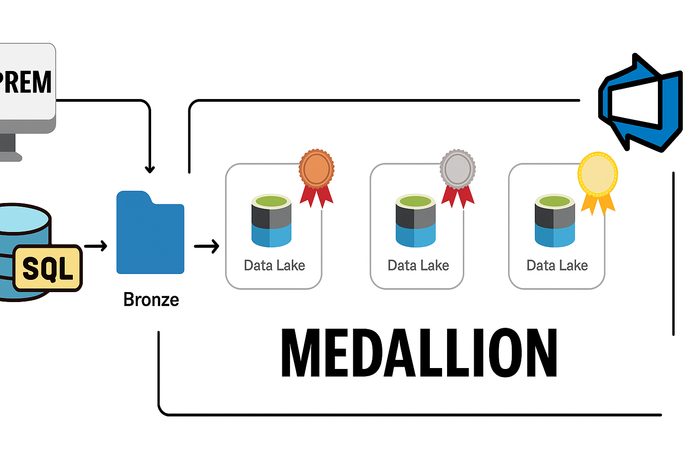

# Azure-Data-Factory-End-to-End-Project

## 📌 Project Overview

This project demonstrates how to design and implement a **Data Engineering pipeline** on Azure using the **Medallion Architecture (Bronze → Silver → Gold)**.
The use case revolves around processing **Airport Datasets** from an **On-Premises environment** to the cloud, applying **transformations, incremental loading, and aggregations**, and making the final curated data available for business consumption.
Silver and Gold layers are stored in **Delta format** for better reliability, performance, and Lakehouse features.

---

## 🏗️ Architecture

* **Bronze Layer** – Raw data ingestion from On-Prem to Azure Data Lake.
* **Silver Layer (Delta)** – Data cleansing, transformations, and incremental load.
* **Gold Layer (Delta)** – Aggregated and business-ready views.

---

## ⚙️ Implementation Steps

### 1. On-Prem Data Simulation

* Created a folder on the on-prem system to store raw airport datasets.
* Copied the **Airport JSON file** into the Bronze layer folder in Azure Data Lake.

### 2. GitHub Integration

* Pushed the **Airport JSON dataset** into a GitHub repository folder to maintain version control.
* Configured Azure Data Factory (ADF) to integrate with GitHub for CI/CD and DevOps.

### 3. Azure SQL Database

* Created an **Azure SQL Database**.
* Designed a table named **`Bookings`** for structured data storage.

### 4. Data Ingestion (Bronze Layer)

* Used **Azure Data Factory Pipelines** to copy data from:

  * On-Prem folder → Data Lake (Bronze container).
  * GitHub folder → Data Lake (Bronze container).
* Ensured initial full load of data.

### 5. Incremental Loading

* Implemented **incremental load logic** to load only new/updated records after the initial load.
* Stored processed data in the **Silver container (Delta format)**.

### 6. Data Transformation (Silver Layer – Delta)

* Built **Dataflows in ADF** for:

  * Cleaning and validating data.
  * Standardizing schema.
  * Handling missing values.
* Stored the transformed data in **Delta format** for:

  * ACID transactions
  * Schema evolution
  * Efficient incremental processing

### 7. Aggregations & Business Views (Gold Layer – Delta)

* Performed **joins, aggregations, and business logic transformations** on the Silver layer data.
* Stored the curated results in the **Gold container (Delta format)** to enable:

  * Optimized analytics
  * Time travel for historical queries
  * Direct BI tool consumption

### 8. Scheduling & Automation

* Configured **Schedule Triggers** in ADF for automated pipeline execution.
* Ensured pipelines refresh Bronze → Silver → Gold data daily.

### 9. DevOps & Git Integration

* Integrated pipelines with **GitHub & Azure DevOps**.
* Enabled **CI/CD** deployment for version-controlled pipeline management.

---

## 🚀 Tech Stack

* **Azure Data Factory (ADF)** – Data orchestration
* **Azure Data Lake Storage (ADLS Gen2)** – Data lake storage
* **Azure SQL Database** – Relational database for structured storage
* **GitHub / Azure DevOps** – Version control and CI/CD
* **Delta Format (Silver & Gold)** – Reliable storage with Lakehouse features
* **Medallion Architecture** – Bronze, Silver, Gold data layers

---

## 📊 Medallion Flow

1. **Bronze** – Raw data (On-Prem & GitHub → Data Lake).
2. **Silver (Delta)** – Cleaned & transformed data (Incremental loading).
3. **Gold (Delta)** – Aggregated & business-ready views.

---

## ✅ Outcomes

* Automated ingestion of on-prem data into Azure cloud.
* Implemented incremental data loading for efficiency.
* Created reusable pipelines for transformations and aggregations.
* Adopted **Delta format** for Silver & Gold layers to enable Lakehouse capabilities.
* Designed **end-to-end Medallion pipeline** with CI/CD integration.
